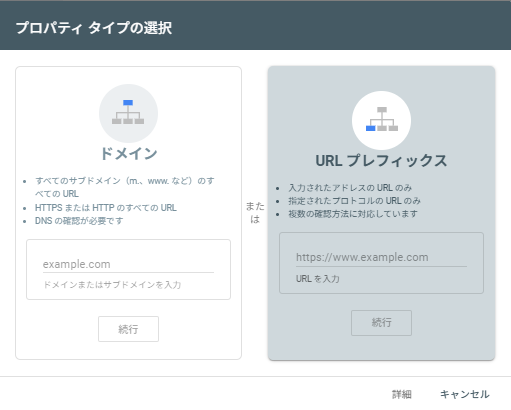

+++
date = '2025-09-06T12:54:32+09:00'
draft = false
title = 'Hugo+Blowfishで構築したサイトをGoogle検索に表示させる手順'
tags = ["Hugo", "Blowfish", "GitHub Pages", "SEO", "Google Search Console"]
+++

## はじめに

**Hugo + Blowfish**テーマで構築し、GitHub Pagesで公開したサイトをGoogle検索結果に表示させるための実践的な手順を解説します。この記事はSEOの基本から具体的な設定まで、初心者でも簡単に実施できるように構成されています。

### 解決する課題
- 作成したサイトがGoogle検索結果に表示されない
- 検索エンジンがサイトを適切にクロールできていない
- Googleにサイトの存在を認識させる方法が分からない
- SEO対策の基本的な設定が不明

### この記事で学べること
- robots.txtの設定とSEOにおける重要性
- Google Search Consoleの基本的な使い方
- サイト所有権の確認方法とベストプラクティス
- インデックス登録の効率的な方法

### 対象読者
- HugoとBlowfishテーマでサイトを構築した方
- GitHub Pagesでサイトをホスティングしている方
- SEO対策を初めて行うWebサイト運営者
- Google検索での可視性を向上させたいブロガー

## 前提条件

- **サイト**: Hugo + Blowfishテーマで構築
- **ホスティング**: GitHub Pagesで公開済み
- **アカウント**: Googleアカウントが必要（Google Search Console用）
- **権限**: サイトのソースコードへの編集権限

## Google検索で表示させるための手順

### Step 0: 準備 - robots.txtの有効化

検索エンジンがサイトを適切にクロールできるよう、Hugo設定でrobots.txtの生成を有効化します：

`config/_default/hugo.toml`
```toml
# 検索エンジンのクロールを許可するrobots.txtを自動生成
enableRobotsTXT = true
```


この設定により、サイトルートに「すべての検索エンジンがサイト全体をクロール可能」という内容のrobots.txtが自動生成されます。


### Step 1: Google Search Consoleへのサイト登録

Googleにサイトの存在を認識させるため、Google Search Consoleでサイトを登録します。

**1. Google Search Consoleへアクセス**

[Google Search Console](https://search.google.com/search-console/about?hl=ja)にアクセスし、Googleアカウントでログインします。

**2. プロパティの追加**

プロパティタイプ選択画面で「**URLプレフィックス**」を選択し、サイトURLを入力します：

```
https://your-username.github.io/
# またはカスタムドメインの場合
https://yourdomain.com/
```



### Step 2: サイト所有権の確認

サイトの所有者であることをGoogleに証明します。

**1. 確認方法の選択**

複数の確認方法がありますが、Hugo + Blowfish環境では「**HTMLタグ**」方式が最も簡単です。表示されたメタタグをコピーします。

**2. メタタグのサイトへの追加**

Blowfishテーマでは、以下の手順でメタタグを追加します：

`layouts/partials/extend-head.html` ファイルを作成または編集：

```html
<!-- Google Search Console所有権確認用メタタグ -->
<meta name="google-site-verification" content="コピーした確認コード" />
```


Blowfishテーマの`extend-head.html`機能を使用することで、サイト全ページの`<head>`セクションに自動的にタグが挿入されます。


**3. サイトのデプロイと確認**

メタタグを追加した後は以下の手順で確認します：

1. 変更をGitHubにプッシュし、GitHub Pagesでデプロイを完了させる
2. サイトが更新されたことを確認（ブラウザでアクセスしてチェック）
3. Google Search Consoleに戻り「**確認**」ボタンをクリック

成功すると「所有権を確認しました」と表示されます。

### Step 3: インデックス登録リクエスト

サイトのGoogleインデックスへの登録をリクエストします。

**1. URL検査ツールの使用**

1. Google Search Consoleの左メニューから「**URL検査**」を選択
2. サイトのURLを入力して検索実行
3. 検索結果画面で「**インデックス登録をリクエスト**」ボタンをクリック


**2. リクエストの完了確認**

正常に完了すると上記のような確認メッセージが表示されます。

### Step 4: サイトマップの送信（推奨）

より効率的なクロールを実現するため、サイトマップを送信します。

**1. サイトマップのURL確認**

Hugoではデフォルトでサイトマップが生成されます：
```
https://your-site.com/sitemap.xml
```

**2. Google Search Consoleでのサイトマップ送信**

1. 左メニューの「**サイトマップ**」を選択
2. 「**新しいサイトマップの追加**」に`sitemap.xml`を入力
3. 「**送信**」ボタンをクリック

## モニタリングと継続的な最適化

### インデックス状況の確認

**1. カバレッジレポートの確認**

左メニューの「**カバレッジ**」からインデックス状況をモニタリングできます。

**2. パフォーマンスのチェック**

「**検索パフォーマンス**」でクリック数、表示回数、CTRなどを確認できます。

### 新記事の継続的なインデックス登録

新しい記事を公開した場合の推奨ワークフロー：

1. 記事を公開し、GitHub Pagesでデプロイ完了
2. Google Search Consoleの「URL検査」で新記事URLをチェック
3. 「インデックス登録をリクエスト」を実行
4. 数日後にインデックス状況を確認

## トラブルシューティング

### よくある問題と解決法

**問題1: 所有権の確認に失敗する**
- **原因**: メタタグが正しく設置されていない
- **解決法**: ブラウザのデベロッパーツールでHTMLソースを確認し、メタタグの存在をチェック

**問題2: インデックス登録が進まない**
- **原因**: robots.txtの設定ミス、サイトのアクセシビリティ問題
- **解決法**: `https://your-site.com/robots.txt`にアクセスして内容を確認

**問題3: サイトマップが読み込まれない**
- **原因**: URLの記述ミス、サイトマップのアクセシビリティ問題
- **解決法**: ブラウザで`https://your-site.com/sitemap.xml`に直接アクセスしてチェック

## まとめ

Hugo + Blowfishで構築したサイトをGoogle検索に表示させるための手順を体系的に解説しました。

### 主要ポイント
- **robots.txt有効化**: 検索エンジンのクロールを許可
- **Google Search Console登録**: サイトの存在をGoogleに通知
- **所有権確認**: HTMLメタタグで簡単に実施
- **インデックスリクエスト**: 能動的な登録申請

## 参考リンク

- [Google Search Console公式ヘルプ](https://support.google.com/webmasters/)
- [Blowfishテーマ公式ドキュメント - サイト設定](https://blowfish.page/ja/docs/configuration/#%E3%82%B5%E3%82%A4%E3%83%88%E8%A8%AD%E5%AE%9A)
- [Hugo公式ドキュメント - SEO](https://gohugo.io/templates/robots/)
- [Google検索セントラル - SEOスターターガイド](https://developers.google.com/search/docs/fundamentals/seo-starter-guide)