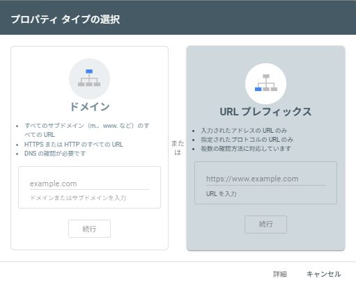
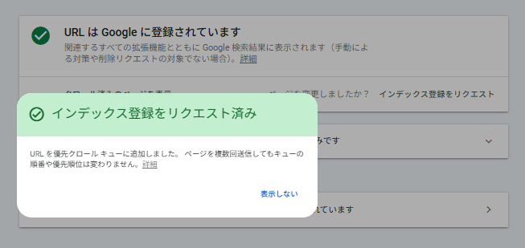

+++
date = '2025-09-06T12:54:32+09:00'
draft = false
title = 'Hugo+Blowfishで構築したサイトをGoogle検索に表示させる手順'
tags = ["Hugo", "Blowfish", "Github Pages", "SEO"]
+++
## はじめに

HugoとBlowfishテーマで作成し、GitHub Pagesで公開しているブログサイトを、Googleの検索結果に表示させるための設定手順を解説します。

手順の概要は以下の通りです。
1.  **Hugo/Blowfishの設定**: 検索エンジンにサイトのクロールを許可します。
2.  **Google Search Consoleでの設定**: Googleにサイトを認識させ、所有権の確認とサイトマップの送信を行います。

## 参考記事

- [Blowfish：サイト設定](https://blowfish.page/ja/docs/configuration/#%E3%82%B5%E3%82%A4%E3%83%88%E8%A8%AD%E5%AE%9A)
- [エンベーター：Googleサーチコンソールとは？基本的な使い方や導入方法を解説](https://envader.plus/article/74)

## ステップ1：robots.txtの有効化

まず、検索エンジンがサイトをクロールできるように、Hugoの設定ファイルで`robots.txt`の生成を有効にします。

`config/_default/hugo.toml`
```toml
# trueに設定すると、検索エンジンがサイト全体をクロールすることを許可するrobots.txtが生成されます。
enableRobotsTXT = true
```

## ステップ2：Google Search Consoleへの登録と設定

次に、Google Search Consoleを利用してサイトをGoogleに登録します。

### 1. Google Search Consoleへアクセス
[Google Search Console](https://search.google.com/search-console/about?hl=ja)にアクセスし、利用を開始します。

### 2. プロパティの追加
プロパティタイプを選択します。今回は「URLプレフィックス」を選択し、ご自身のサイトURL（例: `https://example.com/`）を入力します。



### 3. 所有権の確認
サイトの所有者であることを確認します。複数の方法がありますが、ここでは「HTMLタグ」方式を選択します。表示されたメタタグをコピーしてください。

### 4. メタタグをサイトに追加
コピーしたメタタグをサイトの`<head>`セクションに追加します。Blowfishテーマでは、`layouts/partials/extend-head.html`というファイルを作成または編集し、以下の内容を追記することで簡単に追加できます。

`layouts/partials/extend-head.html`
```html
<!-- Google Search Consoleの所有権確認用メタタグ -->
<meta name="google-site-verification" content="コピーした文字列" />
```
このファイルを配置することで、サイトの全ページの`<head>`内に指定したタグが挿入されます。

### 5. 所有権の確認を実行
サイトをデプロイした後、Google Search Consoleの画面に戻り、「確認」ボタンをクリックします。無事に所有権が確認されれば、設定は完了です。

### 6.Google Search Consoleにてインデックスへ登録申請
左側のメニューより「URL検査」を選択
自分のサイトのURLを入力して検索。検索後に表示される「インデックス登録をリクエスト」を選択



正常完了すると上記が表示される。

## まとめ：検索結果に表示されるまで

上記の手順が完了すると、Googleのクローラーがあなたのサイトを巡回し、内容をインデックスに登録するようになります。

- **インデックス登録のリクエスト**: 新しい記事を公開した際など、早くインデックスさせたい場合は、Search Consoleの「URL検査」ツールから個別にリクエストを送信できます。
- **反映までの時間**: サイトが検索結果に表示されるまでには、数日から数週間かかる場合があります。インデックス状況はSearch Consoleで確認できます。

これで、サイトがGoogle検索に表示されるための基本的な設定は完了。
