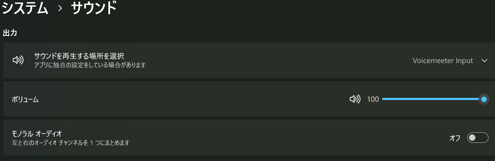
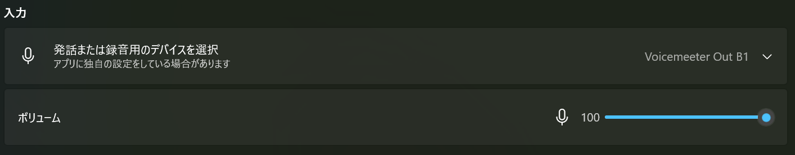
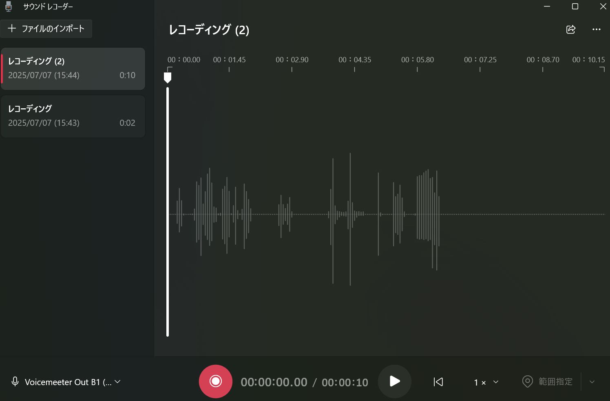

+++
date = '2025-08-10T20:50:45+09:00'
draft = true
title = 'パソコン内音声を録音する手順'
+++
## 1.はじめに

オンラインミーティングにてパソコンの内部音声だけクリアに録音したいときにVoicemeeterでの
録音がおすすめです。

オンラインミーティングを録音する場合は必ず参加メンバーの許可を取ってから録音してください。


Windowsの標準機能だけでは、この「PC内部音声の録音」は少し手間がかかります。しかし、フリーソフト「Voicemeeter」を使えば、誰でも簡単にPC内部の音声を録音できるようになります。
この記事では、Voicemeeterのインストールから設定、そして実際にサウンドレコーダーで録音するまでの手順を、画像を交えて分かりやすく解説します。

Voicemeeterについて公式サイトの説明
> Voicemeeter は、任意のオーディオデバイスやアプリケーションから、またはそれらへのあらゆる音声ソースをミックス・管理するために、仮想入出力（Virtual I/O）として機能する仮想オーディオデバイスを備えたオーディオミキサーアプリケーションです。
> 
## 2.ハンズオン

### voicemeeterの入手とインストール
1.  [VB=AUDIO software](https://vb-audio.com/Voicemeeter/)からvoicemeeterをダウンロード
2. voicemeetersetupをインストール
3. PCを再起動

### voicemeeterのセットアップ
1. 「サウンド」にて出力デバイスを設定
	
2. 「サウンド」にて入力デバイスを設定
	

#### 各設定
- Voicemeeter Out B1	仮想出力 B1（Default VAIO）
	- 一般的な仮想マイク（Google Meet等）
- Voicemeeter Out B2	仮想出力 B2（AUX VAIO）	
	- Zoomなど別ルート用に使う
- Voicemeeter Out B3	仮想出力 B3（VAIO3）
	- さらに追加の音声ルートが欲しい時
- Voicemeeter Out A1〜A5	物理的な出力（スピーカーなど）
	- 録音や再生には使わない

3. voicemeeterを起動
4. voicemeeterの「Streo Input」にて対象のマイクを設定
5. voicemeeterの「Streo Input」にて対象のスピーカーを設定

### サウンドレコーダーで録音
※録音時はVoicemeeterを起動するして、上記の入出力デバイスに設定する必要がある
準備ができたら録音

## 3.参考リンク
 - [Youtube：【Windows 11】パソコン内音声を録音する手順](https://www.youtube.com/watch?v=9jRQ6osMsUM&t=349s)
 - [VB=AUDIO software](https://vb-audio.com/Voicemeeter/)