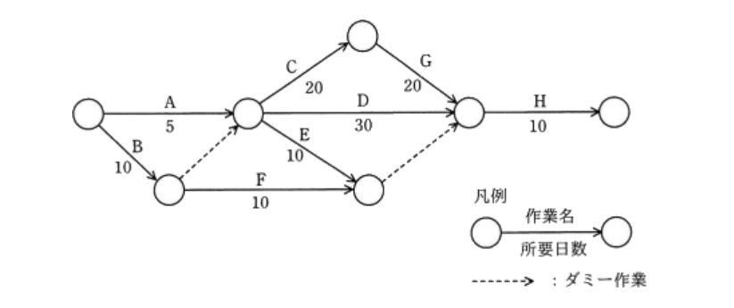

+++
id = "251001213539"
date = '2025-10-01T21:35:39+09:00'
draft = false
title = '【応用情報技術者試験】テクノロジ系学習メモ：マルチメディア'
tags = ["応用情報技術者試験"]
+++
## 概要

応用情報技術者試験のテクノロジ系学習のマルチメディアメモを集約する。

### 参考資料
- [応用情報技術者過去問道場](https://www.ap-siken.com/apkakomon.php)
- [令和07年【春期】【⁠秋期】応用情報技術者 合格教本](https://gihyo.jp/book/2024/978-4-297-14620-7)

## 学習メモ

### パンくずリスト

Webサイト内でユーザーが現在閲覧しているページの位置を、トップページからの階層構造で示したもの\
**名前の由来**: 童話「ヘンゼルとグレーテル」で、主人公が森で迷わないようにパンくずを落として道しるべにした逸話から

### パルス符号変調(PCM)

アナログ信号をデジタル信号に変換する手法

**手順**
1. 標本化(サンプリング):アナログ信号を一定の時間間隔で区切り、その瞬間の値を取り出す処理。サンプリング周波数(Hz) = 1秒間にサンプリングする回数
2. 量子化:標本化で得られたアナログ値を、最も近い離散的な値(整数値)に近似する処理。量子化ビット数 = 1つの値を表現するために使うビット数
3. 符号化:量子化で得られた整数値を、0と1の2進符号に変換する処理

### レンダリング

3D空間の物体のデータ(形状、質感、光源など)を基に、2次元の画像を生成する処理

### レイトレーシング法

光源から出た光が物体に反射し、視点に届くまでの経路を逆に追跡することで、リアルな画像を生成するレンダリング手法
- 光の反射や屈折を精密に計算できる

### スキャンライン法

スクリーンの走査線ごとに視点とその走査線を結ぶ走査面を作成し，各走査面と描画の対象となる物体との交差を調べて交差線分を求め，奥行き判定を行うことによって描画する手法

### スキャンライン法・レイトレーシング法との違い

スキャンライン法は画面上の走査線ごとに物体の描画を行う手法で、高速にレンダリングできるが、光の複雑な表現が不可能\
レイトレーシング法は光線を追跡してリアルな反射・屈折・影を表現できるが、計算量が多く処理が重い

### Zバッファ法

視点からの奥行き情報(Z値)をピクセルごとに保持し、不要な部分(隠れた部分)を描画しないことで、効率的に隠面消去を行うレンダリング手法

### ラジオシティ法

物体表面での光の相互反射(間接光)を計算することで、柔らかな陰影や、部屋の壁が照らし合う様子などをリアルに表現するレンダリング手法

### アンチエイリアシング

斜線や曲線の境界に生じる階段状のギザギザ(ジャギー)を、中間色を補うことで滑らかに見せる手法

### ディザリング

色数が限られた環境で、異なる色のピクセルを隣接して配置することで、擬似的に中間色や多くの色を表現する手法

### メタボール

複数の球体を定義し、それらが融合し合うような滑らかで有機的な曲面を生成するモデリング手法\
液体や粘体などの表現に用いられる

### 帯域幅の計算

`解像度 × 色深度 × フレームレート`\
**例**: 800×600×24×30 = 345.6 Mbps

### 音声データ容量計算

`サンプリング周波数 × 量子化ビット数 × 時間`\
**例**: 11,000Hz × 8bit × 60秒 = 5,280,000ビット = 660,000バイト

### 帯域幅（R6秋午前問26）

**問題**
- 解像度: 800 × 600 ピクセル
- 色深度: 24ビットフルカラー
- フレームレート: 30フレーム/秒

上記の動画像の配信に最低限必要な帯域幅はいくつか。

**計算**
1.  **1フレームあたりのデータ量**
    `800 × 600 ピクセル × 24 ビット/ピクセル = 11,520,000 ビット = 11.52 Mビット`

2.  **1秒あたりのデータ量（帯域幅）**
    `11.52 Mビット/フレーム × 30 フレーム/秒 = 345.6 Mビット/秒 (Mbps)`

**答え**
345.6 Mbps

### 色数（H17春午前問22）

**問題**
あるディスプレイのビデオメモリは、解像度「800 × 600画素」で最大「2^16色」の表示が可能である。このビデオメモリを流用して解像度を「1600 × 1200画素」に変更した場合、表示できる最大の色数はいくつか。

**計算**
1.  **必要なビデオメモリ容量の計算**
    - 1画素あたりのデータ量: 2^16色を表現するには16ビット（= 2バイト）必要。
    - ビデオメモリ容量: `800 × 600 画素 × 2 バイト/画素 = 960,000 バイト`

2.  **変更後の解像度で1画素あたりに割り当てられるデータ量の計算**
    - 変更後の総画素数: `1600 × 1200 画素 = 1,920,000 画素`
    - 1画素あたりのデータ量: `960,000 バイト / 1,920,000 画素 = 0.5 バイト = 4 ビット`

3.  **最大色数の計算**
    4ビットで表現できる色数は `2^4` 色。

**答え**
2^4色

### 音声サンプリング（H18春午前問55）

**問題**
- サンプリング周波数: 11,000回/秒
- 量子化ビット数: 8ビット
- 記録媒体: 32 × 10^6 バイトの容量を持つUSBメモリ

この条件で、最大何分間の音声を保存できるか。

**計算**
1.  **1秒あたりのデータ量**
    `11,000 回/秒 × 8 ビット/回 = 88,000 ビット/秒`

2.  **1分あたりのデータ量（バイト単位）**
    - `88,000 ビット/秒 × 60 秒/分 = 5,280,000 ビット/分`
    - `5,280,000 ビット/分 / 8 ビット/バイト = 660,000 バイト/分`

3.  **記録可能な時間（分）**
    `32,000,000 バイト / 660,000 バイト/分 ≈ 48.48 分`

**答え**
最大 **48分**

### アローダイアグラムにおける総余裕日数（H31春午前問53）

**問題**

> 応用情報技術者試験 平成31年春期 午前問53 より引用

上図のアローダイアグラムにおいて、総余裕日数は何日か。

**計算**
総余裕日数は「その作業の開始をどれだけ遅らせても、プロジェクト全体のスケジュールに影響を与えないか」を示す日数。以下の手順で計算する。

1. **最遅結合点時刻の計算（終点から始点へ）**
   B・C・G・H のルート（60日）
   プロジェクトの最短完了日数（クリティカルパス）は **60日**

2. **最早結合点時刻の計算（始点から終点へ）**
   H・D・B（30日）

3. **作業Fの総余裕日数の計算**
    `総余裕日数 = 最遅結合点時刻 - 最早結合点時刻`
    `総余裕日数 = 60 - 30 = 30`

**答え**
**30日**
