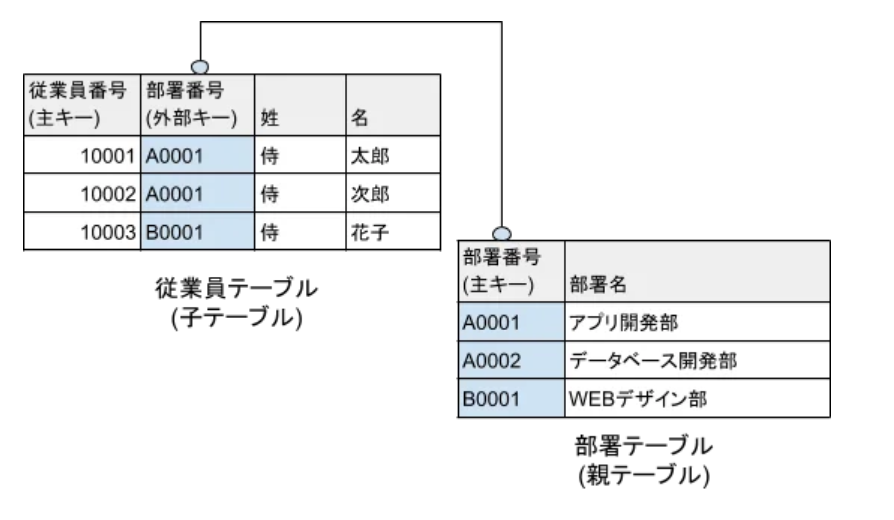

+++
id = "251010090349"
date = '2025-10-10T09:03:49+09:00'
draft = false
title = '【応用情報技術者試験】テクノロジ系学習メモ：データベース'
tags = ["応用情報技術者試験"]
+++
## 概要

応用情報技術者試験のテクノロジ系学習メモを集約する。

### 参考資料
- [応用情報技術者過去問道場](https://www.ap-siken.com/apkakomon.php)
- [令和07年【春期】【⁠秋期】応用情報技術者 合格教本](https://gihyo.jp/book/2024/978-4-297-14620-7)

## 学習メモ

### ACID特性

データベースのトランザクション（SQLなどの処理における最小単位）処理における必要な4つの特性を指す

**Atomicity**（原子性）\
トランザクション内の処理がすべて実行されるか、または全く実行されないことを保証する性質

**Consistency**（一貫性）\
データに矛盾が発生しないことを保証する性質

**Isolation**（独立性）\
複数のトランザクションを同時に実行した場合と，順番に実行した場合の処理結果が一致する性質

**Durability**（耐久性）\
正常に終了したトランザクションの更新結果は，障害が発生してもデータベースから消失しない性質

### 2相コミット
ネットワークで接続された複数のデータベース（分散データベース）にまたがるトランザクションの一貫性を保証する仕組み

- **フェーズ**:
  - **準備フェーズ（Phase 1）**: コーディネータが全参加者（各データベース）にコミット可能か問い合わせる。各参加者は処理を実行し、結果（コミット可能か否か）をログに記録して応答する。
  - **コミットフェーズ（Phase 2）**: 全員から「コミット可能」の応答があれば、コーディネータは全員にコミットを指示。一人でも「不可能」の応答があれば、全員にロールバックを指示する。
- **参加者**:
  - **コーディネータ**: トランザクション全体を調整し、コミットかロールバックかを決定する役割。
  - **パーティシパント**: 各データベースサイトで、トランザクションの一部を実行する役割。
- **利点と課題**: 分散環境での原子性を確保できる。一方で、準備フェーズで応答不能な参加者がいると、全参加者がその応答を待ち続けるブロッキング状態になる課題がある。

### 3層スキーマ
データベースの構造を「外部」「概念」「内部」の3つの視点（層）に分けて定義する考え方。 各層を独立させることで、一方の変更が他方に影響を与えにくくする。

**構成要素**
- **外部スキーマ（ビュー）**: ユーザーやアプリケーションから見たデータベースの構造。 必要なデータだけを特定の形式で見せるためのもので、SQLのビュー（VIEW）がこれにあたる。
- **概念スキーマ（論理構造）**: データベースに格納されるすべてのデータの論理的な構造や関係性を定義したもの。 開発者視点のスキーマであり、テーブル定義などが該当する。
- **内部スキーマ（物理構造）**: データがストレージ（HDDなど）に物理的にどのように格納されるかを定義したもの。 インデックスの設定やデータファイルの配置などが含まれる。

### 関係データベース

データを「リレーション」と呼ばれる二次元の表（テーブル）の形式で管理するデータベース

- **基本概念**:
  - **リレーション（テーブル）**: 行（タプル）と列（属性）で構成される表形式のデータ集合。
  - **タプル（行）**: テーブル内の一件分のデータ。レコードとも呼ばれる。
  - **属性（列）**: データの項目。フィールドやカラムとも呼ばれる。
  - **主キー**: テーブル内の一つの行を一意に識別するための属性（またはその組み合わせ）。
  - **外部キー**: 他のテーブルの主キーを参照する属性。テーブル間の関連付けに用いられる。

> 引用元：[【SQL入門】外部キーとは？主キーとの関係や作成方法について解説](https://www.sejuku.net/blog/54072)
