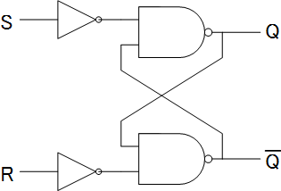

+++
id = "251010135128"
date = '2025-10-10T13:51:28+09:00'
draft = false
title = 'NAND型RSフリップフロップ'
tags = ["応用情報技術者試験"]
+++
## NAND型RSフリップフロップとは？

NANDゲートを2つたすきがけすることで構成される論理回路

- デジタル回路における基本的な記憶素子の一つ
- 1ビットの情報（0か1）を記憶し、保持することが可能
- RSフリップフロップの「RS」は、それぞれ**セット（Set）**と**リセット（Reset）**の頭文字に由来

> ja:User:Signed-C - 投稿者が撮影, CC 表示-継承 3.0, https://commons.wikimedia.org/w/index.php?curid=1622845による

## NAND型RSフリップフロップの特徴

1. 2つの出力(Q と Q̄)をもち、この2つのビットは必ず逆になる。
  2つの出力(Q と Q̄)をもち、**S=R=0の禁止状態を除き、**この2つのビットは必ず互いに逆の値になります。
2. S＝0，R＝1の状態にすると出力Qは1にセットされる。(Q＝1)
  入力Sに「0」、Rに「1」が入力されると、出力Qは「1」に**セット**されます。\
  Sが入力されるNANDゲートは、入力に「0」があるため出力（Q）が必ず「1」になります。\
  その結果、もう一方のNANDゲートの入力は両方とも「1」となり、出力（Q̄）は「0」になります。
1. S＝1，R＝0の状態にすると出力Qは0にリセットされる。(Q＝0)
  入力Sに「1」、Rに「0」が入力されると、出力Qは「0」に**リセット**されます。\
  Rが入力されるNANDゲートの出力（Q̄）が「1」になり、その結果、\
  もう一方のNANDゲートの出力（Q）が「0」になります。
1. 2つの入力が共に1の時が安定状態となる
  入力SとRがともに「1」の場合、フリップフロップは直前の出力状態を**保持**します。 \
  例えば、Qが「1」であれば「1」のまま、Qが「0」であれば「0」のままとなります。\
  これは、NANDゲートの出力がもう一方の入力に影響を与え合い、安定した状態を維持するためです。

### 真理値表

| S | R | Qn+1 | Q̄n+1 | 状態 |
|---|---|---|---|---|
| 0 | 0 | 1 | 1 | 禁止 |
| 0 | 1 | 1 | 0 | セット |
| 1 | 0 | 0 | 1 | リセット |
| 1 | 1 | Qn | Q̄n | 保持 |

*(Qnは現在の状態、Qn+1は次の状態を示します)*

## 参考リンク

- [Wikipedia：フリップフロップ](https://ja.wikipedia.org/wiki/%E3%83%95%E3%83%AA%E3%83%83%E3%83%97%E3%83%95%E3%83%AD%E3%83%83%E3%83%97#RS%E5%9E%8B)
- [応用情報技術者過去問道場：平成27年秋期　問22](https://www.ap-siken.com/apkakomon.php)
