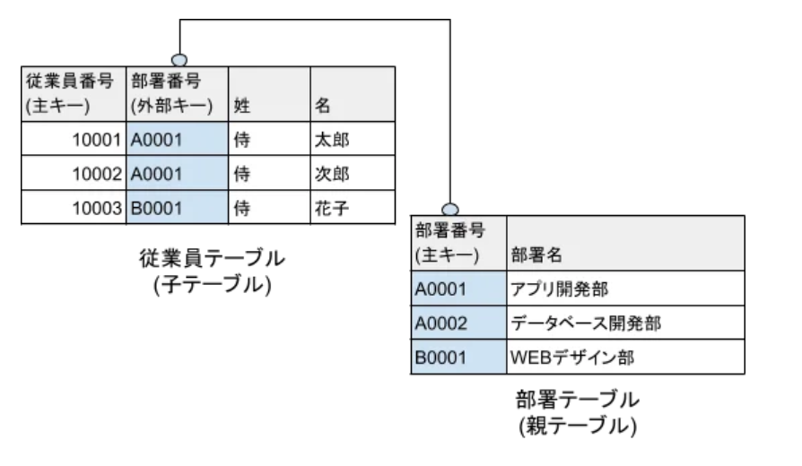

+++
date = '2025-10-01T21:35:39+09:00'
draft = false
title = '【応用情報技術者試験】テクノロジ系学習メモ'
tags = ["応用情報技術者試験"]
+++
## 概要

応用情報技術者試験のテクノロジ系学習メモを集約する。

### 参考資料
- [応用情報技術者過去問道場](https://www.ap-siken.com/apkakomon.php)
- [令和07年【春期】【⁠秋期】応用情報技術者 合格教本](https://gihyo.jp/book/2024/978-4-297-14620-7)

## 学習メモ

### 基数変換問題で無限小数を素早く判定する方法

基数変換問題で無限小数を判定するような問題では**分母の素因数分解**で判定できる。

**手順**:
1. 判定対象の数値を分数に変換
2. この分数の既約分数(約分してこれ以上割れない形)にする
3. 分母を因数分解する
4. このとき、分母が対象の基数のべき乗のみ場合は有限小数。基数のべき乗以外の場合は無限小数と判断できる

**具体例**:
1. 0.05
2. 0.125
3. 0.5
- 上記の3つの10進数小数のうち、2進数に変換すると無限小数になるのは?
- 手順に則ってそれぞれ分母を因数分解すると
  1. 0.05 = 5/100 = 1/20 = 1/2^2***5**
  2. 0.125 = 125/1000 = 1/8 = 1/2^3
  3. 0.5 = 5/10 = 1/2 = 1/2^1
- 「1:0.05」で分母に「5」が紛れていることがわかる。よって、「0.05」が無限小数と判定できる。

### リスト

順序付けられたデータの並び。主なデータ構造として、配列と連結リストが存在する。

### 配列

個々の要素の位置を固定して、要素が格納されている番地(アドレス)を簡単に計算できるようにしたデータ構造

**特徴**
- ダイレクトアクセス(任意の要素への直接参照)が可能
- 要素の挿入・削除には非効率
  - 当該位置の要素を一つずつ前後に移動させる必要があるため
- 予め最大データ数に対応した領域を確保する必要がある

### 連結リスト
各要素をポインタでつないだデータ構造
- ポインタの接続方法で3種類に分類できる

### 単方向リスト（線形リスト・片方向リンク）
各要素は次の要素へのポインタを持つ

### 双方向リスト（双方向リンク）

各要素は前後両方の要素のポインタを持つ。
- 単方向リストとの違いとして、途中要素への挿入・削除は双方向が容易である。

### 循環リスト

末尾の用が先頭要素へのポインタを持つ単方向リスト

### 配列と連結リストの違い

**記憶域**: 1つのデータあたりの必要な記憶域は連結リストのほうが大きい
- 連結リストでは「データ + ポインタ」で管理されるため

**追加・削除**: 要素の追加・削除においては連結リストのほうが容易
- 連結レストでは、配列と異なり、番地が固定されていないため、ポインタの値変更のみで済むため

**記憶域の変化**: 連結リストでは必要な記憶域は動的に変化して、データ数に比例する

- 連結リストにおける要素の追加・削除
  - 応用情報技術者試験ではHead(先頭要素へのポインタ)・Tail(末尾要素へのポインタ)について出題される
  - Head・Tail・E1～E5のリストを具体例に解説する。
    - 具体例:
      
      graph LR
      Head --> E1;
      subgraph "Singly Linked List"
          E1 --> E2 --> E3 --> E4 --> E5 --> Null([null]);
      end
      Tail --> E5;

      style Head fill:#f9f,stroke:#333,stroke-width:2px
      style Tail fill:#ccf,stroke:#333,stroke-width:2px
      style Null fill:#eee,stroke:#333,stroke-dasharray: 5 5
      

    - 要素E0を先頭に追加する場合
      - 1. E0のポインタ部でE1を設定
      - 2. HeadでE0のアドレスを設定
    - 要素E6を末尾に追加する場合
      - 1. TailからたどったE5のポインタ部でE6を設定
      - 2. TailでE6のアドレスを設定
    - 要素E1を先頭から削除する場合
      - 1. HeadからたどったE1のポインタ部の値である「E2のアドレス」をHeadに設定
    - 要素E5を末尾から削除する場合
      - 1. Headから順番にE4までたどる
      - 2. E4のポインタ部にNULLを設定
      - 3. TailにE4のアドレスを設定

### マージソート

データを最小単位(要素が1つ)になるまで半分に分割し、その後、それらを正しい順序で「マージ(併合)」していくことで全体のソートを完成させるソート方法

### 値呼び出し

引数の渡し方において、関数内で変数の値を上書きしても元の変数の値には反映されない。

### 参照呼出し

引数の渡し方において、関数内で変数の値を上書きすると元の変数の値に反映される。

### 再入可能プログラム（リエントラントプログラム）

複数のタスクから同時に呼び出されても、それぞれに対して正しい結果を返すことができるプログラム

### 再入可能プログラムの実現方法

1. プログラムを「手続部分」と「データ部分」に分離する
2. 複数のタスクで共有するのは「手続部分」・「データ部分」は各タスク単位で用意することで再入可能プログラムを実現できる。

### 再帰プログラム（リカーシブプログラム）

手続きの中で自分自身を呼び出して使うことができるプログラム

- 自分自身を呼び出すことができる
- 実行途中の状態はスタックを用いてLIFO方式で制御
- 再入可能

### 再使用可能プログラム（リユーザブルプログラム・逐次再使用可能プログラム）

一度実行したプログラムをロードし直さずに再度実行しても、正しい結果を返すことができるプログラム

### 再配置可能プログラム（リロケータブルプログラム）

プログラムを主記憶上のどのアドレスに配置しても実行できるようにしたプログラム

- 多くの場合、ベースアドレス指定方式などを用いて、プログラムが配置された先頭アドレス(ベースアドレス)を軸にアドレス計算を行い、命令やデータへのアクセスが可能になっている。

### ニモニックコード（表意コード）

商品の略称や記号など、記憶しやすいように意味を持たせたコード
- 具体例：「B5」→ B5用紙

### VLIW（Very Long Instruction Word）

プログラムのコンパイル時に、一つの命令語で複数の命令を同時に実行する手法。

- CPUのオーバーヘッドが減り高速化が可能
- 複数の処理を一つの命令に記述するため1命令が非常に長くなる

### ページング

メモリ領域を「ページ」と呼ばれる固定サイズの区画に分割して仮想記憶を管理する方式
- 仮想アドレス空間と物理アドレス空間をページ単位で対応付けて管理する

### ページ置換の基本的な流れ
1. ページフォールトが発生
  - ページフォールト:CPUがアクセスしようとしたページが主記憶上に存在しないときに発生するハードウェア割り込み
2. 主記憶に空きがなければ、置換アルゴリズム(LRU、FIFO等)により主記憶上から補助記憶装置に移すページを決定
3. 手順2で決定したページを補助記憶装置に移動(ページアウト)
  - ページアウト:主記憶上のページを補助記憶装置(ディスク)に書き出す処理
4. 必要なページを補助記憶装置から主記憶に読み込み(ページイン)
  - ページイン:補助記憶装置上のページを主記憶に読み込む処理

### LRU(Least Recently Used)

最も長い間参照されていないページを置換するアルゴリズム

*   **動作:** 最後に参照されてから最も時間が経過しているページを追い出します。 プログラムが特定の領域を集中してアクセスするという「参照の局所性」の原理に基づいています。
*   **長所:** 一般的にFIFOよりも効率が良く、性能が高い傾向にあります。
*   **短所:** どのページがいつ参照されたかをすべて記録しておく必要があるため、実装が複雑になり、システムのオーバーヘッドが大きくなる可能性があります。

### FIFO(First In First Out)

最も古く読み込まれたページを置換する最も単純なアルゴリズム

*   **動作:** メモリに最初に入ってきたページ（最も古くから存在するページ）を最初に追い出します。
*   **長所:** 実装が非常に簡単です。
*   **短所:**
    *   頻繁にアクセスされる重要なページであっても、古くからメモリにあれば追い出されてしまいます。
    *   物理メモリのサイズを増やしたにもかかわらず、ページフォールト（必要なページがメモリ上にない状態）が増えてしまう「ベラディの異常（Belady's Anomaly）」と呼ばれる現象が発生することがあります。

### ベラディの異常

仮想記憶システムにおいて、プロセスのために割り当てる物理メモリのページフレーム数を増やしたにもかかわらず、かえってページフォールトの発生回数が増加してしまうという、直感に反する現象

### LFU(Least Frequently Used)

「最も使用頻度が低い」ページを置き換えるアルゴリズムです。

*   **動作:** これまでの参照回数が最も少ないページを追い出します。
*   **長所:** 長期間にわたって頻繁に参照されるページをメモリに保持し続けることができます。
*   **短所:**
    *   各ページの参照回数を記録・管理する必要があるため、実装が複雑です。
    *   過去に集中的にアクセスされたページが、その後全く使われなくなっても、参照回数が多いためにメモリに残り続けてしまうという問題があります。

###　LIFO (Last-In, First-Out)

「後入れ先出し」とも呼ばれ、スタック構造で利用されるアルゴリズム

*   **動作:** 最後にメモリに入ってきたページを最初に追い出します。
*   **特徴:** 実際のページ置き換えアルゴリズムとしては**ほとんど使用されません**。理論的な比較対象や、データ構造の概念として重要です。応用情報技術者試験では選択肢として出題される場合があります。

### フラグメンテーション

主記憶や補助記憶装置にて使用されない記憶領域の断片が多く存在した状態になる現象

### スラッシング

メモリ容量が不足している状態で、要求されるメモリ量が多すぎるために、メモリと補助記憶装置間でのデータの入れ替え(ページイン・ページアウト)が非常に頻繁に発生し、システムの処理速度が著しく低下してしまう現象

**発生するケース**: 主記憶の容量が十分でない場合、プログラムの多重度を増加させると、システムのオーバーヘッドが増加するため、発生しやすい。

### キャッシュメモリにおけるダイレクトマップ方式

一つのメモリブロックをキャッシュ内の単一のロケーションに割り当てる。

### メモリのデータ転送速度の計算（H31春午前問10）

**問題要件**
  - バス幅:16bit
  - メモリサイクルタイム:80ナノ秒
  - 求められる解答:このメモリのデータ転送速度は何Mbyte/秒

**計算式**
  - 1秒間のデータ転送回数
    - 1秒/80ナノ秒
  - 16bit = 2byte
  - 「1秒間のデータ転送回数」*「2byte」
    - 25Mbyte/秒

**正答**:
- 25Mbyte/秒

### オブジェクトストレージ

「オブジェクト」という単位でデータを格納・管理する記憶方式\
（具体例：Amazon S3）

### イミュータブルストレージ

一度書き込んだデータの変更・削除が不可能な「不変」の特性を持つストレージ

**用途**: ランサムウェア対策としてバックアップデータの保護\
**効果**: 攻撃者に侵入されてもバックアップデータの改ざんを防ぐ

### 3層クライアントサーバシステム

システムを3層(プレゼンテーション層・ファンクション層・データベースアクセス層)に分けたシステム
  - プレゼンテーション層:
    - GUIなどユーザーインターフェース処理を担当
  - ファンクション層:
    - データ処理を担当
  - データベースアクセス層:
    - データベース処理を担当

**メリット**
- 業務ロジックに変更が生じても、クライアントへの影響が少ない
- アプリケーションの修正などが頻繁なシステムでは導入効果が高い
- 各層の独立性が高いため、開発作業を並行して実施できる

### グリッドコンピューティング

PCから大型コンピュータまで，ネットワーク上にある複数のプロセッサに処理を分散して，大規模な一つの処理を行う方式

### CAP定理

分散処理システムにおいては、一貫性・可用性・分断耐性の3つの特性のうち、最大でも同時に2つまでしか満たすことができないとする定理

**一貫性(Consistency)**: データの整合性が常に保たれていること\
**可用性(Availability)**: 利用したいときに求める分だけ利用できること\
**分断耐性(Partition Tolerance)**: データを複数のサーバに分散して保管していること

### MTBF(Mean Time Between Failure / 平均故障間隔)

故障してから次に故障するまでの平均時間

### MTTR(Mean Time To Repair / 平均修理時間)

故障時に修理が完了するまでの平均時間

### 稼働率の計算

**計算式**: MTBF / (MTBF + MTTR)
  - 計算式が成り立つ理由
    - 故障してから次の故障するまでの時間を1つのサイクルとする
      - 1つのサイクルの時間 = MTBF + MTTR
    - サイクル中にシステムが正常に稼働している時間はMTBFと等しい
    - 上記より、稼働率の計算式は「稼働率 = 正常にシステムが稼働している時間 / 1つのサイクルの時間」が成り立つ

### 故障率の計算

**計算式**: 1 / MTBF
  - 計算式が成り立つ理由
    - 例として、「1000時間稼働させると平均1回故障する部品」があるとする。
    - 故障率は「1時間あたりに何回故障するかという指標」
    - この例におけるMTBFは「1000時間」
    - 上記より、故障率の計算式は「1/1000」つまり、「1/MTBF」が成立する
  - 補足
    - 「単位」に着目するとより明確になる
      - MTBFの単位: 時間/回 (1回あたりの時間)
      - 故障率の単位: 回/時間 (1時間あたりの回数)

### フォールトトレランス

故障してもシステム全体として必要な機能を維持させようとする考え方

### フォールトトレラントシステム

フォールトトレランスの考えが反映されたシステム

### フォールトアポイダンス

構成要素個々の品質を高めて、故障そのものの発生を防ぐこと

### フェールソフト

故障発生時に、性能の低下を受け入れて、システム全体を停止させずに稼働を維持させる考え方

### フォールバック(縮退運転)

フェールソフトにおいて、機能低下状態で稼働をつづけること

### フェールセーフ

誤作動や故障時の影響を最小限にとどめて、システムを安全に制御するという考え方\
**具体例**: 信号機の故障時にすべての信号を赤信号の状態にする。

### フェールオーバ

障害発生時に別システムに自動的に引き継がせて利用者に故障などを悟らせないという考え方
- 障害回復時に元のシステムへ戻すことを「フェールバック」と呼ぶ。

### フォールトマスキング

障害が発生しても、影響が外部に出ないようにする考え方

### フールプルーフ

誤った操作などされても、システムに異常が出ないように設計する考え方

### インタロック

安全を確保する「連動した制約」\
**より詳細な定義**: ある一定の条件が満たされない限り、次の操作ができないようにする、あるいは特定の動作をさせないようにする仕組み\
**具体例**: 電子レンジについて、ドアが完全に閉まっていないと、マイクロ波の照射が始まらない。

### カーネル

OSとしてコンピュータやアプリを制御するための基本的な機能のみを実装したソフトウェア\
**より詳細な定義**:\
カーネルはOSの中核(コア)で、主にハードウェア(CPU、メモリ、デバイス)と\
アプリケーション(プロセス)の橋渡し役を担い、重要なリソース管理やプロセス管理などの基本機能を持つソフトウェア\
**「基本的な機能」の補足**: 基本的な機能とは、プロセス管理、メモリ管理、デバイス管理、ファイルシステム管理、ネットワーク管理などを指す

### タスクのスケジューリング方式

複数のタスクを並列処理する場合の処理方法

**分類**:
- ノンプリエンションなスケジューリング方式
  - 到着順番方式
- プリエンプションなスケジューリング方式
  - 優先順位方式
  - ラウンドロビン方式
  - フィードバック待ち行列方式
  - 処理時間方式

### ノンプリエンション（協調的マルチタスク）

一度CPUの使用権を得たタスクが、自らの処理を終えるか、I/O待ちなどで自発的にCPUを解放(手放す)するまで、他のタスクにCPUを横取りされない方式
**特徴**:
    - OSがタスクを強制的に中断させない
    - CPUを独占するタスクがあると、他のタスクが全く実行できない

### プリエンプション（強制的(プリエンプティブ)マルチタスク）

OSのスケジューラが、より優先度の高いタスクが来た場合や、一定の時間が\
経過した場合などに、現在実行中のタスクを強制的に中断させ、\
別のタスクにCPUの使用権を割り当てる方式\
**特徴**:
- OSのスケジューラがタスクの切り替えを実施する
- このとき中断されたタスクが再開されるとき中断された状態から再開される

### 到着順番方式（FCFS(First Come First Served)）

タスクには優先度が設定されず、実行可能状態になったタスクから処理される方式

### 優先順位方式

タスクに割り当てられた優先度の高い順に実行する方式

### 優先順位方式の種類
- 静的優先順位方式:優先度をあらかじめきめて変更しない方式
  - 特徴:スタベージョンが発生する可能性がある。
- 動的優先度順方式:優先度を変更する方式(待ち時間が一定時間以上のタスクの優先度を高くするなど)
  - 別名:エージング方式
    - 優先度を高くして実行の可能性を与えることを「エージング」と呼ぶため。

### スタベージョン

タスクにCPU使用権が割り当てられず、なかなか実行されてない状態

### リソーススタベーション

タスクの実行に必要なリソースを与えられない状態

### ラウンドロビン方式

実行可能待ち行例の先頭のタスクから順番にCPU時間(タイムクウォンタム)を割り当てる方式
- 実行タスクがタイムクウォンタム内に終了しない場合は、実行を中断して次のタスクにCPUに割り当てる
- タイムシェアリングシステムのスケジューリングに適している。

### フィードバック待ち行列方式（多段待ち行列方式）

ラウンドロビン方式に優先度を加えて方式

### 処理時間順方式（SPT(Shortest Proccessing Time First)方式）

処理時間の短いタスクから順番に実行する方式
- 実際には残り処理時間を予測することは不可能のため、フィードバック待ち行列方式として実現されている。

### Hadoop

ペタバイト級の大規模データの蓄積・処理の分散処理を実現するミドルウェア

主に「HDFS(Hadoop Distributed File System)」という分散ファイルシステムと\
「MapReduce」という分散処理プログラミングモデルを中心に構成されている

### GPL（General Public License）

GNUプロジェクトのためにリチャード・ストールマンにより制作されたフリーソフトウェアライセンス
- 「コピーレフト」という概念を採用している

### コピーレフト

GPLでライセンスされたソフトウェアを改変またはそれを基にした派生著作物を配布する際に、\
そのソフトウェアや派生著作物もGPLのもとで配布しなければならないというルール

### MOSトランジスタ

金属と半導体の間に酸化物絶縁体を挟んだ構造を持つ半導体素子。金属(M)、酸化膜(O)、半導体(S)の三層構造を持つ。\
**使用用途**: ゲート電圧を変えることで通過する電流量を細かく制御できるため、スイッチや増幅器として多用される。

### SoC(System on a Chip)

必要とされる全ての機能(システム)を集積した1個の半導体チップ\
**メリット**:
- 専有面積の削減
- 高速化
- 低消費電力化
- コスト削減

### HDL(Hardware Description Language)

デジタル回路の設計や構成をテキストベースで記述できるハードウェア記述言語の総称\
FPGAなどに実装するデジタル回路を記述し，論理合成するために使用される\
**具体例**: VHDL、Verilog、SystemCなど

### DSP(Digital Signal Processor)

主にリアルタイムコンピュータで使用される、デジタル信号処理に特化したプロセッサ\
積和演算などの機能を内蔵しているので，デジタルフィルターを実現するのに適している。

### ユーザー調査手法：アンケート

質問票を配布してユーザーから回答を集める手法。大規模な調査が可能、定量的データの収集

### 思考発話法

被験者に操作をしながら考えていることを声に出してもらい、思考プロセスを分析する手法。ユーザーの思考過程を直接把握可能

### 回顧法

操作後に操作内容やその時の判断、感想などを思い出してもらい、ヒアリングする手法。操作完了後に実施

### ログデータ分析法

ユーザーの操作ログを収集・解析し、利用状況や問題点を定量的に評価する手法。客観的データに基づく分析

### 認知的ウォークスルー法

専門家がユーザーの視点に立ってタスクを実行し、ユーザーが目標を達成できるか、操作で迷わないかなどを評価する手法

### ヒューリスティック評価

専門家が経験則(ヒューリスティックス)に基づいて、UIなどがガイドラインに沿っているかを評価する手法

### パンくずリスト

Webサイト内でユーザーが現在閲覧しているページの位置を、トップページからの階層構造で示したもの\
**名前の由来**: 童話「ヘンゼルとグレーテル」で、主人公が森で迷わないようにパンくずを落として道しるべにした逸話から

### パルス符号変調(PCM)

アナログ信号をデジタル信号に変換する手法

**手順**
1. 標本化(サンプリング):アナログ信号を一定の時間間隔で区切り、その瞬間の値を取り出す処理。サンプリング周波数(Hz) = 1秒間にサンプリングする回数
2. 量子化:標本化で得られたアナログ値を、最も近い離散的な値(整数値)に近似する処理。量子化ビット数 = 1つの値を表現するために使うビット数
3. 符号化:量子化で得られた整数値を、0と1の2進符号に変換する処理

### レンダリング

3D空間の物体のデータ(形状、質感、光源など)を基に、2次元の画像を生成する処理

### レイトレーシング法

光源から出た光が物体に反射し、視点に届くまでの経路を逆に追跡することで、リアルな画像を生成するレンダリング手法
- 光の反射や屈折を精密に計算できる

### スキャンライン法

スクリーンの走査線ごとに視点とその走査線を結ぶ走査面を作成し，各走査面と描画の対象となる物体との交差を調べて交差線分を求め，奥行き判定を行うことによって描画する手法

### スキャンライン法・レイトレーシング法との違い

スキャンライン法は画面上の走査線ごとに物体の描画を行う手法で、高速にレンダリングできるが、光の複雑な表現が不可能\
レイトレーシング法は光線を追跡してリアルな反射・屈折・影を表現できるが、計算量が多く処理が重い

### Zバッファ法

視点からの奥行き情報(Z値)をピクセルごとに保持し、不要な部分(隠れた部分)を描画しないことで、効率的に隠面消去を行うレンダリング手法

### ラジオシティ法

物体表面での光の相互反射(間接光)を計算することで、柔らかな陰影や、部屋の壁が照らし合う様子などをリアルに表現するレンダリング手法

### アンチエイリアシング

斜線や曲線の境界に生じる階段状のギザギザ(ジャギー)を、中間色を補うことで滑らかに見せる手法

### ディザリング

色数が限られた環境で、異なる色のピクセルを隣接して配置することで、擬似的に中間色や多くの色を表現する手法

### メタボール

複数の球体を定義し、それらが融合し合うような滑らかで有機的な曲面を生成するモデリング手法\
液体や粘体などの表現に用いられる

### 帯域幅の計算

`解像度 × 色深度 × フレームレート`\
**例**: 800×600×24×30 = 345.6 Mbps

### 音声データ容量計算

`サンプリング周波数 × 量子化ビット数 × 時間`\
**例**: 11,000Hz × 8bit × 60秒 = 5,280,000ビット = 660,000バイト

### リング型配線

LANの代表的な接続形態(トポロジー)の一つで、全てのノードがリング(輪)のように一方向または双方向に接続される方式


graph LR
  %% リング型トポロジー
  subgraph リング型トポロジー
    A --- B --- C --- D --- A
  end


### スター型配線

LANの代表的な接続形態(トポロジー)の一つで、中心となるネットワーク機器(スイッチやハブ)を中心に、各機器が放射状に接続される形態


graph LR
  %% スター型トポロジー
  subgraph スター型トポロジー
    S((スイッチ・ハブ))
    A -- 接続 --> S
    B -- 接続 --> S
    C -- 接続 --> S
    D -- 接続 --> S
  end


### バス形配線

LANの代表的な接続形態(トポロジー)の一つで、すべてのデバイスが一本の主幹ケーブル(バス)に接続され、データはこのバスを通じて送受信される形式


graph LR
  %% バス型トポロジー
  subgraph バス型トポロジー
    direction LR
    A --- B --- C --- D
  end


### コネクション型通信

回線を確保したまま通信を行う方式\
**具体例**: 電話・回線交換方式

### コネクションレス型通信

通信前に受信相手を確認せずに一方的にデータを送信する方式。\
送信するパケットに宛先を示す情報を付与する必要がある。\
**具体例**: パケット交換方式

### TCP(Transmission Control Protocol)

送信するデータが正確に、かつ送信した順序通りに相手に届くことを保証する、信頼性の高い通信プロトコル

- OSI参照モデルの第4トランスポート層に位置する。
- 信頼性を確保するための確認応答や制御が多いため、UDPに比べて通信速度が遅くなる傾向がある。
- コネクション型通信。3ウェイハンドシェイクで通信経路を確立する。

### UDP(User Datagram Protocol)

データの転送速度やリアルタイム性を重視したプロトコル

- OSI参照モデルの第4トランスポート層に位置する。
- プロトコルがシンプルなため、高速で遅延が少ない通信が可能
- コネクションレス型通信。TCPのような事前のコネクション確立を実施しない。

### RDP(Remote Desktop Protocol)

リモートデスクトップ接続で使用される通信プロトコル\
遠隔地からのPC操作、サーバ管理にて使用される。\
**ポート番号**: TCP/3389\

### SSL-VPN

SSLプロトコルを使用したVPN接続方式
- Webブラウザから接続可能、専用クライアント不要の場合もある
- リモートワーク環境での安全な社内ネットワークアクセスにて使用される。

### MIME(Multipurpose Internet Mail Extension)

メールでにて日本語の"2バイトコード"や画像データを送信するための仕組み\
**使用用途**: ASCII文字しか使用できないSMTPを利用したメールで利用される。

### IMAPS(IMAP over SSL/TLS)

メール受信プロトコルであるIMAP(Internet Message Access Protocol)にTLSを組み合わせ、\
TLSによって暗号化された通信コネクション上でメール受信を行うプロトコル\
**補足**: バージョン番号を付けてIMAP4Sと表記されることもある。

### ポート番号

ネットワーク上でデータ通信を行う際に、コンピュータ内で動作している\
特定のプログラムやサービスを識別するための番号\
**URLで宛先のポート番号を指定する場合**: ホスト名の直後に":"(コロン)と数字で指定する

### ウェルノウンポート

インターネットプロトコルにおいて、特定のサービスやアプリケーション用に予約された標準的なポート番号(0-1023番)\
- IANA(Internet Assigned Numbers Authority)により管理・割り当て
- システム権限(root権限)でのみバインド可能
- 全世界で統一された標準番号

### 主要なウェルノウンポート一覧

| プロトコル/サービス | ポート番号 | プロトコル | 用途 |
|---|---|---|---|
| FTP(データ用) | 20 | TCP | ファイル転送のデータ通信 |
| FTP(制御用) | 21 | TCP | ファイル転送の制御コマンド |
| SSH | 22 | TCP | 安全なリモートログイン・暗号化通信 |
| Telnet | 23 | TCP | リモートログイン(平文通信) |
| SMTP | 25 | TCP | メール送信 |
| DNS | 53 | TCP・UDP | ドメイン名前解決 |
| DHCP(サーバ用) | 67 | UDP | IPアドレス自動割り当て(サーバ側) |
| DHCP(クライアント用) | 68 | UDP | IPアドレス自動割り当て(クライアント側) |
| HTTP | 80 | TCP | Web通信(平文) |
| POP3 | 110 | TCP | メール受信 |
| NTP | 123 | UDP | 時刻同期 |
| IMAP4 | 143 | TCP | メール受信(サーバ上でメール管理) |
| SNMP | 161 | UDP | ネットワーク機器管理・監視 |
| SNMP Trap | 162 | UDP | ネットワーク機器からの通知・アラート |
| HTTPS | 443 | TCP | 暗号化Web通信(SSL/TLS) |

### DNSレコード

ドメイン名とIPアドレスを紐づけるなど、インターネット上でドメイン名を管理するための重要な情報

### Aレコード (Address Record)

ドメイン名(ホスト名)をIPv4アドレスに対応付ける、最も基本的なDNSレコード\
- ユーザーがブラウザにウェブサイトのドメイン名を入力した際に、そのサイトが置かれているサーバーのIPアドレスを特定

### AAAAレコード (Quad A Record)

AレコードのIPv6版で、ドメイン名(ホスト名)をIPv6アドレスに対応付ける
- IPv6アドレスでウェブサイトにアクセスするために必要

### CNAMEレコード (Canonical Name Record)

あるドメイン名(エイリアス)を別の正規のドメイン名(Canonical Name)に関連付けるために使用
- 複数のドメイン名を一つのウェブサイトに向けたり、管理を簡素化する
- IPアドレスを直接指定するのではなく、別のドメイン名を指し示す

### MXレコード (Mail Exchange Record)

そのドメイン宛てのメールを配送するメールサーバーを指定するためのレコード
- メールサーバーがどのサーバーにメールを届ければよいかを確認
- 優先度の数値が小さいサーバーから順に配送が試行される

### PTRレコード (Pointer Record)

IPアドレスからドメイン名(ホスト名)を特定するために使用される(逆引き)
- メールサーバーが受信したメールの送信元IPアドレスの信頼性を確認
- なりすましメール対策として利用される。設定が正しくないとメールがスパムとして扱われる可能性がある

### OP25B(Outbound Port 25 Blocking)

ISPが用意したスパムメール対策の仕組み
- ISPが用意したメールサーバーを経由しないメール(高確率でスパムメール)を弾くようになっている。

### OP25Bにおけるサブミッションポートの役割

- OP25Bを回避するための「正規のユーザー専用通用口」
- サブミッションポートは、OP25Bでブロックされるポート25の代替となる、メール送信専用のポートです。ポート番号は587番が標準として定められています。

### OP25Bの対象外になる対象
- 固定IPからの送信
- SMTP-AUTHで認証済ノードからの送信

### SPF(Sender Policy Framework)

メールを送信しようとしてきたメールサーバのIPアドレス情報を検証することで身元検証する技術

### SPFの手順

1. 送信側は、送信側ドメインのDNSサーバのSPFレコード(またはTXTレコード)に正当なメールサーバのIPアドレスやホスト名を登録し、公開しておく。
2. 送信側から受信側へ、SMTPメールが送信される。
3. 受信側メールサーバは、受信側ドメインのDNSサーバを通じて、MAIL FROMコマンドに記載された送信者メールアドレスのドメインを管理するDNSサーバに問い合わせ、SPF情報を取得する。
4. SPF情報との照合でSMTP接続してきたメールサーバのIPアドレスの確認に成功すれば、正当なドメインから送信されたと判断する。

### プロキシサーバ

クライアントPCの代理としてWebサイトにアクセスする中継サーバ
利用用途として、「URLフィルタリング」による業務上不要なサイトへの接続禁止などを設定する

### URLフィルタリング

宛先URLをチェックし、許可/禁止リストと照合して通信を検証・フィルタリングする

### IEEE 802.11a/n

無線LAN(Wi-Fi)の技術規格

- 802.11a:5GHz帯、最大54Mbps
- 802.11n:2.4GHz/5GHz両対応、MIMO技術でより高速化

### IEEE 802.1Q

タグVLAN(仮想LAN)の技術規格\
**用途**: ネットワークセグメント分離、VLAN間通信制御

### IEEE 802.1X

LANに接続する端末の認証規格

**用途**:
  - MACアドレス認証
  - 認証サーバを用いた端末認証
  - 社内LANへの不正アクセス防止

**実装**: 認証サーバ(RADIUS等)と連携した認証システム

### nslookup

DNSサーバに名前解決を問い合わせ、結果を確認するコマンド\
**基本形**: `nslookup <名前> [DNSサーバ]`\
**例**: `nslookup www.example.com 192.168.11.41`\

**用途**:
- DNS名前解決の動作確認
- DNSサーバの応答性能測定
- ドメイン名とIPアドレスの対応関係確認

**類似コマンド**: dig(UNIX系)、host(UNIX系)

### ping

宛先への到達可否と遅延(往復時間)を確認するコマンド\
**用途**: 基本的な疎通確認

### tracert

宛先までに経由するルータの一覧と遅延を可視化するコマンド\
**用途**: ネットワーク経路の調査

### arp

IPアドレスとMACアドレスの対応表を表示・更新するコマンド\
**用途**: ARPテーブルの確認・操作

### ipconfig

端末のネットワーク設定の表示・更新するコマンド\
**用途**: ネットワーク設定の確認・変更

### 情報セキュリティの3要素(CIA)

- 機密性 (Confidentiality)
- 完全性 (Integrity)
- 可用性 (Availability)

### 情報セキュリティの3要素(CIA)：機密性 (Confidentiality)

認可された者のみが情報にアクセス可能であること\
**脅威**: データ窃取、不正アクセス\
**対策**: アクセス制御、暗号化

### 情報セキュリティの3要素(CIA)：完全性 (Integrity)

情報が破壊・改ざんされていないこと\
**脅威**: データ改ざん、不正な変更\
**対策**: 電子署名、ハッシュ値による検証

### 情報セキュリティの3要素(CIA)：可用性 (Availability)

必要な時に情報にアクセス可能であること\
**脅威**: DoS攻撃、システム障害\
**対策**: 冗長化、負荷分散

### 否認防止の特性

情報セキュリティマネジメントの付加的な要素で、行った操作や発生した事象を後になって否認されないように証明できる能力
**補足**: JIS Q 27000:2019(情報セキュリティマネジメントシステム－用語)において定義されている

### CC（Common Criteria：情報セキュリティ国際評価基準）

IT製品やシステムのセキュリティ機能を評価し認証するための基準を定めた規格\
ほぼそのままの形でISO 15408(日本版では JIS X 5070)として国際標準化されている。

### 耐タンパ性

暗号システムやハードウェアが物理的な不正操作や改ざん(タンパー)に対して耐えられる能力

### 境界型防御

社内ネットワーク(信頼できる)とインターネット(信頼できない)の境界で通信を制御する防御手法\
**実装**: ファイアウォール、IDS/IPS\
**弱点**: 内部犯行、正当な通信を装った攻撃に対応困難

### ゼロトラスト

「何も信頼しない」を前提とし、全てのアクセス要求に対して厳格な認証と認可を行うセキュリティモデル\
**原則**: いかなる通信も信頼しない\
**適用場面**: クラウド環境、リモートワーク環境

### 多層防御

複数の対策を組み合わせ、一つの対策が破られても他の対策で攻撃を防ぐ考え方\
**例**:
- ネットワーク層:ファイアウォール、WAF
- アプリケーション層:入力検証、プレースホルダ
- データ層:ハッシュ化、暗号化
- 運用層:監視、ログ分析

### CSIRT

対象とする範囲でセキュリティ上の問題が起きていないかどうかを監視するとともに、発生したセキュリティインシデントについて対応するチームや組織の総称

### PSIRT

製品セキュリティインシデント対応チーム\
**言い換えると**: 自社製品版のCSIRT

### SQLインジェクション

Webアプリケーションの入力フィールドに不正なSQL文を挿入し、データベースを不正操作する攻撃\
**影響**: データの窃取、改ざん、削除が可能\
**対策**: プレースホルダ(バインド機構)の使用、入力値検証

### 辞書攻撃

特定のIDに対して、一般的な単語や頻用されるパスワードをリスト化した「辞書」を用いてログイン試行する攻撃\
**特徴**: IDを固定し、パスワードを総当たりする\
**対策**: アカウントロックアウト、複雑なパスワードポリシー

### ブルートフォース攻撃

パスワードを総当たりで試行する攻撃手法\
**特徴**: すべての可能な組み合わせを試行する\
**対策**: アカウントロックアウト、複雑なパスワードポリシー

### リバースブルートフォース攻撃

パスワードを固定し、IDを総当たりする攻撃手法\
**特徴**: 一般的なパスワードを多数のIDに対して試行する\
**対策**: レート制限、異常なアクセスパターンの検知

### レインボーテーブル攻撃

事前に計算したハッシュ値とパスワードの対応表を使用してパスワードを推測する攻撃\
**対象**: ハッシュ化されたパスワードの解析\
**対策**: ソルト、ペッパーの使用

### サプライチェーン攻撃

直接の攻撃対象ではなく、関連する業者や取引先を経由して本来の標的にアクセスする攻撃手法\
**特徴**: 信頼関係を悪用し、防御が手薄な経路から侵入する\
**対策**: 取引先のセキュリティ監査、ゼロトラスト原則の適用

### Man-in-the-Browser(MITB)攻撃

PCに侵入したマルウェアが，利用者のインターネットバンキングへのログインを\
検知して、Webブラウザから送信される振込先などのデータを改ざんする攻撃

### クリプトジャッキング

マイニング作業（暗号資産を入手するための計算処理）を他のコンピュータに秘密裏に代行させる行為

### PPAP

パスワード付きZIPファイルをメールで送信し、パスワードを別メールで送る方式\
**問題点**: 誤送信時に暗号化ファイルとパスワードが両方とも漏えい、同一経路での盗聴リスクがある\
**対策**: パスワードを電話や携帯メールなど異なる手段で伝達する

### フォールスネガティブ

本来は検知すべき悪意のある活動を、誤って害のないものとして分類すること。
- 自分なりに言い換えると「セキュリティが対象を見逃すこと」

### フォールスポジティブ

本来は通過させるべき害のない活動を、誤って悪意のあるものとして分類すること。
- 自分なりに言い換えると「セキュリティの過剰反応」

### 多要素認証

複数の異なる認証要素を組み合わせる認証方式

**認証3要素**:
- 知識情報:ID・パスワード(知っていること)
- 所持情報:スマートフォン・ICカード(持っているもの)
- 生体情報:指紋・顔認証(自分自身の特性)

### ロックアウトのしきい値

パスワード認証に規定回数失敗した際にアカウントを一時的にロックするまでの失敗回数\
**目的**: 辞書攻撃、ブルートフォース攻撃の対策\
**限界**: リバースブルートフォース攻撃(IDを分散させた攻撃)には効果が限定的

### SAML認証（Security Assertion Markup Language）

一度のログインで複数のクラウドサービスやアプリケーションにアクセス可能にする「シングルサインオン(SSO)」を実現するための標準規格

**メリット**
- 利便性の向上:ユーザーは一度ログインするだけで、SAML連携している複数のサービスに追加のログインなしでアクセスできます。
- セキュリティの強化:IdP側で多要素認証やアクセス制御ポリシーを一元的に設定・管理できるため、全体のセキュリティレベルが向上します。
- 管理コストの削減:IT管理者はIdPでアカウント情報を一元管理できるため、サービスごとにIDを発行・管理する手間が省け、運用負荷が軽減されます。

**デメリット**
- 対応サービスの制約:連携したいクラウドサービス側がSAML認証に対応している必要があります。対応していない場合は、別途開発が必要になることがあります。

### SAML認証の仕組み：SP起点の認証フロー

- SAML認証の登場人物
  - ユーザー: サービスを利用する本人。
  - IDプロバイダー (IdP): ユーザーのID情報を管理し、認証を行うサービス(例: Microsoft Entra ID、Oktaなど)
  - サービスプロバイダー (SP): ユーザーが利用したいクラウドサービスやアプリケーション(例: Salesforce, Concur, Adobeなど)
- SP起点の認証フロー
  1. ユーザーがSP(例:クラウドサービスA)にアクセスします。
  2. SPはユーザーが未認証であるため、IdPにリダイレクトさせるための「SAML認証要求」を生成し、ユーザーのブラウザに送り返します。
  3. ユーザーのブラウザは、受け取ったSAML認証要求をIdPに送信します。
  4. IdPのログイン画面が表示され、ユーザーはIDとパスワードを入力して認証を行います。
  5. 認証が成功すると、IdPは「SAMLアサーション」と呼ばれるXML形式の認証情報を生成し、ユーザーのブラウザに送ります。
  6. ユーザーのブラウザは、このSAMLアサーションをSPに送信します。
  7. SPは受け取ったSAMLアサーションを検証し、正当なユーザーであればログインを許可します。

### SAML認証の仕組み：IdP起点の認証フロー

- SAML認証の登場人物
  - ユーザー: サービスを利用する本人。
  - IDプロバイダー (IdP): ユーザーのID情報を管理し、認証を行うサービス(例: Microsoft Entra ID、Oktaなど)
  - サービスプロバイダー (SP): ユーザーが利用したいクラウドサービスやアプリケーション(例: Salesforce, Concur, Adobeなど)

- IdP起点の認証フロー
    1. ユーザーはIdPのポータルサイトなどにアクセスし、ログインします。
    2. ログイン後、IdPの画面に表示されている利用可能なサービス一覧から、利用したいSP(例:クラウドサービスA)を選択します。
    3. IdPはSAMLアサーションを生成し、ユーザーのブラウザに送ります。
    4. ユーザーのブラウザは、SAMLアサーションをSPに送信します。
    5. SPはSAMLアサーションを検証し、ログインを許可します。

### SAML認証とOAuthの違い

SAMLとよく比較される規格に「OAuth(オーオース)」があります。両者の主な違いは役割

- SAML:ユーザーが誰であるかを証明する「認証」と、そのユーザーに何をする権限があるかを示す「認可」の両方を扱う。
- OAuth:主に「認可」を目的としたプロトコル。例えば、「あるアプリにGoogleアカウントの写真へのアクセスを許可する」といった場面で使われ、ユーザー自身の認証は実施しない。

### 3Dセキュア

オンライン決済時に本人のみが知る情報(パスワードや属性情報等)を入力させることで、利用者本人が取引を行っていることを確認する仕組み

**どうやって3Dセキュアを実現する**？\
事前にカード発行会社に登録したパスワードやワンタイムパスワード、SMS認証、生体認証などで本人確認を行い、不正利用を防ぐ

**名称の由来**: なんで3Dセキュアって呼ぶ？\
- 3Dセキュアの「3D」は「3つのドメイン(Domain)」を意味しています。具体的には、
  - イシュアドメイン(カード発行会社の領域)
  - アクワイアラドメイン(加盟店の領域)
  - 相互運用ドメイン(これら2つをつなぐ国際カードブランドの領域)
- この3つのドメイン間で認証に関わる情報交換の手続きを規定する仕組みであり、「3Dセキュア」と名付けられています

### ハッシュ関数

任意の長さのデータを固定長の不可逆なデータ(ハッシュ値)に変換する関数\
**特性**: 一方向性(逆算困難)、雪崩効果(わずかな変更で大きく変化)\
**用途**: パスワード保存、デジタル署名、データ完全性確認

### 公開鍵暗号

**基本ルール**:
- 署名:送信者の秘密鍵で署名 → 送信者の公開鍵で検証
- 暗号化:受信者の公開鍵で暗号化 → 受信者の秘密鍵で復号

**特徴**: 処理速度が遅い\
**用途**: 共通鍵の配送、電子署名\

### 共通鍵暗号

暗号化と復号に同一の鍵を使用する暗号方式\
**特徴**: 処理速度が速い\
**用途**: 大容量データの暗号化

### ハイブリッド暗号

共通鍵暗号と公開鍵暗号を組み合わせた暗号方式\
**仕組み**: データは高速な共通鍵暗号で暗号化し、その共通鍵を公開鍵暗号で保護\
**メリット**: 高速性と安全性の両立

### 電子署名

メッセージの送信者を認証し、内容の改ざんを検知する技術\
**仕組み**: 送信者の秘密鍵で署名、受信者の公開鍵で検証\
**目的**: 認証(誰が送ったか)、完全性(改ざんされていないか)の確保

### S/MIME

メールの電子署名と暗号化を行うセキュリティ技術
**機能**: 認証、完全性、機密性を保証
**構成要素**: 電子署名、ハイブリッド暗号、電子証明書

### ソルト

パスワードハッシュ化時にユーザーごとに異なる値を付加する技術\
**目的**: レインボーテーブル攻撃の対策\
**保存場所**: データベースの会員テーブル内

### ペッパー

パスワードハッシュ化時に全ユーザー共通の秘密値を付加する技術\
**目的**: データベース漏えい時の追加保護\
**保存場所**: 設定ファイルなど、データベースとは別の安全な場所\
**利点**: データベースを窃取されてもペッパーは入手されない

### RSAと楕円曲線の違い

**両者の違い**:
- 楕円曲線暗号(ECC)とRSAは、いずれも公開鍵暗号方式ですが、根本的な仕組みと特徴に明確な違いがある。
- RSAは「大きな素数の積の素因数分解が困難」という性質を利用
- 楕円曲線暗号(ECC)は「楕円曲線上の離散対数問題が困難」という性質を利用

  特徴     |  RSA             |  楕円曲線暗号(ECC)
  -------|------------------|-----------------
  数学的基盤  |  素因数分解の困難さ       |  楕円曲線上の離散対数問題
  鍵サイズ   |  大(2048bit以上推奨)  |  小(256bit程度で高強度)
  計算コスト  |  高い              |  低い
  通信量    |  多い              |  少ない
  普及度    |  歴史長く広く普及        |  近年の新規プロトコルで主流化

### WPA2(Wi-Fi Protected Access 2)

無線LANのセキュリティを保護するための規格
- AESが暗号アルゴリズムとして利用される
  - RSAやECCではない理由はAESのほうが処理速度で優れているため。

### CRL（Certificate Revocation List）

公開鍵基盤(PKI)において失効した(信用性のない)公開鍵証明書のリスト

### プレースホルダ

SQLクエリの構造と値を完全に分離する仕組み\
**効果**: SQLインジェクション攻撃を原理的に防ぐ\
**実装**: 外部入力値が埋め込まれる箇所を専用の記号(?など)に置き換える

### SIEM（Security Information and Event Management）

様々なIT機器のログを一元的に収集・分析し、セキュリティインシデントの兆候をリアルタイムで検知する仕組み\
**目的**: セキュリティインシデントの発生を迅速に検知する\

### EDR(Endpoint Detection and Response)

PC・サーバ(エンドポイント)での不審な挙動を検知し、インシデント発生後の迅速な対応を支援するソリューション\
**機能**: ネットワーク遮断、不審なプロセス終了\
**対象**: 未知の攻撃による侵入後の対応

### WAF(Web Application Firewall)

Webアプリケーションへの攻撃を検知・防御する専用ファイアウォール\
**対象**: SQLインジェクション、XSS等のアプリケーション層攻撃

### デジタルフォレンジックス

電磁的記録(デジタルデータ)の証拠保全、調査及び分析を行う技術・手続き\
**目的**: サイバー攻撃の原因究明、被害範囲の特定、法的証拠の確保\
**対象**: PC・サーバ内のログ、ファイル等の電子データ\
**補足**: 応用情報技術者試験の情報セキュリティの午後問題にて、たまに記述式の問題で出題されるので覚える

### モジュール結合度

モジュール同士の関連性の強さを表す度合い
  - モジュール結合度の強弱(1が弱。6が強)
    - 1. データ結合:データだけ受け渡す
    - 2. スタンプ結合:処理に必要なデータだけをデータ構造として受け渡す
    - 3. 制御結合:モジュールの動作を制御するための要素を受け渡す
    - 4. 外部結合:大域宣言された単一のデータを複数のモジュールで参照
    - 5. 共通結合:大域宣言されたレコードや構造体などのデータ構造を、複数のモジュールが参照
    - 6. 内容結合:モジュールの内部を直接参照
  
    - 「データ結合」は頻出

### ペトリネット（Petri Net）

プレース、トランジション、トークンの3つの要素を使用した有向グラフでシステムの動作を記述する図法\
**使用例**: 並行する処理同士の制御の流れや同期のタイミングを分析・設計するために使用される。

### OCSP（Online Certificate Status Protocol）

リアルタイムでデジタル証明書の失効情報を検証し、有効性を確認するプロトコル\

**OCSPの確認手順**
OCSPクライアントは、確認対象となるデジタル証明書のシリアル番号等をOCSPレスポンダに送信し、\
有効性検証の結果を受け取ります。この仕組みを利用することで、クライアント自身がCRL(証明書失効リスト)を取得・検証する手間を省くことができます。

### DNSキャッシュポイズニング攻撃

DNSサーバーの「キャッシュ」に偽の情報を意図的に注入(ポイズニング＝毒を盛る)することで、\
ユーザーを正規のウェブサイトになりすました悪意のある偽サイトへ誘導するサイバー攻撃

### DNSの基本的な仕組み

**DNSの通常処理手順**

1.  ユーザーがブラウザに `www.example.com` と入力すると、PCは近くのキャッシュDNSサーバー(プロバイダなどが管理)に「`www.example.com` のIPアドレスは何ですか?」と問い合わせます。
2.  キャッシュDNSサーバーに答え(キャッシュ)がなければ、目的の情報を管理している権威DNSサーバーに問い合わせに行きます。
3.  権威DNSサーバーから正しいIPアドレス (`93.184.216.34`) を受け取ります。
4.  キャッシュDNSサーバーは、そのIPアドレスを一定期間キャッシュ(一時保存)し、ユーザーに返します。次回同じ問い合わせが来た際は、権威DNSサーバーまで聞きに行かずにキャッシュから素早く応答できます。

### DNSキャッシュポイズニング攻撃の仕組み

DNSキャッシュポイズニング攻撃は、上記のステップの**2と3の間**に割り込みます。
1.  攻撃者は、まず標的となるキャッシュDNSサーバーに、まだキャッシュされていないドメイン名(例: `www.victim-bank.com`)の問い合わせをさせます。
2.  キャッシュDNSサーバーが権威DNSサーバーに問い合わせを行っている、ごくわずかな隙を突いて、攻撃者は権威DNSサーバーになりすまし、偽の応答をキャッシュDNSサーバーに送りつけます。
3.  この偽の応答には、「`www.victim-bank.com` のIPアドレスは、攻撃者が用意した偽サイトのIPアドレス (`10.0.0.99`) です」という嘘の情報が含まれています。
4.  攻撃者は、本物の権威DNSサーバーからの応答よりも先に、かつDNSの通信ルール(トランザクションIDなど)に合った偽の応答を送る必要があります。
5.  キャッシュDNSサーバーがこの偽の応答を信じてしまうと、偽のIPアドレスをキャッシュに保存してしまいます。
6.  その後、このキャッシュDNSサーバーを利用している一般のユーザーが `www.victim-bank.com` にアクセスしようとすると、キャッシュDNSサーバーは汚染されたキャッシュから偽サイトのIPアドレスを返してしまいます。
7.  ユーザーは、本物の銀行サイトにアクセスしているつもりで、攻撃者が用意したそっくりの偽サイトに誘導され、IDやパスワード、個人情報を盗まれてしまいます。

- 被害例
  - フィッシング詐欺:偽の銀行サイトやショッピングサイトに誘導し、ログイン情報やクレジットカード情報を盗み取ります。
  - マルウェア感染:偽サイトにアクセスしたユーザーに、ウイルスやスパイウェアなどのマルウェアをダウンロードさせます。
  - 通信の傍受:偽のサーバーを中継させることで、メールなどの通信内容を盗聴します。

### DNSキャッシュポイズニング攻撃への対策
DNSキャッシュポイズニングへの対策は、DNSサーバー管理者側と利用者側の両方で実施する。

- サーバー管理者側の対策
  - DNSソフトウェアの最新化:既知の脆弱性をなくすため、DNSサーバーのソフトウェアを常に最新の状態に保ちます。
  - ソースポートランダマイゼーション
    - DNSの問い合わせに使う送信元ポート番号をランダム化し、攻撃者が偽の応答を送り込む際の推測を困難にします。
  - DNSSEC (DNS Security Extensions) の導入
    - DNSの応答に電子署名を付与し、その応答が正当なサーバーから送られ、改ざんされていないことを検証する仕組みです。
    - 最も効果的な対策の一つとされています。

- 利用者側の対策
  - 信頼できるDNSサービスの利用:ISPが提供するDNSサーバーや、セキュリティ対策が施されたパブリックDNS(例: Google Public DNS `8.8.8.8`, Cloudflare `1.1.1.1`)を利用することが推奨されます。
  - HTTPSの確認:ウェブサイトを訪れた際、URLが「https://」で始まり、ブラウザのアドレスバーに鍵マークが表示されていることを確認します。DNSキャッシュポイズニングによって偽サイトに誘導されても、攻撃者は正規のSSL/TLS証明書を持つことが困難なため、ブラウザが警告を表示することが多くあります。
  - セキュリティソフトの導入:不正なサイトへのアクセスをブロックする機能を持つセキュリティソフトを導入し、常に最新の状態に保ちます。

### DNSSEC(DNS Security Extensions)

DNSの応答が「正当な管理者から発信され、途中で改ざんされていないこと」を保証するための拡張機能

- DNSに「電子署名」の仕組みを追加することで、DNSの応答に信頼性を与える技術

### DNSSECについて電子署名による応答の保証
- ドメインの管理者(権威DNSサーバーの管理者)は、秘密鍵と公開鍵のペアを作成します。
- 管理者は、自分の管理するDNSレコード(例: www.example.com のIPアドレス情報)に対して、秘密鍵を使って電子署名を作成します。この署名情報はRRSIGレコードとしてDNSに追加されます。
- 署名の検証に使う公開鍵は、DNSKEYレコードとしてDNSで公開されます。
- DNSの応答を受け取った側(キャッシュDNSサーバー)は、このDNSKEYレコード(公開鍵)を使って、RRSIGレコード(署名)が正しいかどうかを検証します。
- 検証に成功すれば、「このDNSレコードは正当な管理者によって署名され、改ざんされていない」ことが証明されます。

### サニタイジング

ユーザーが入力したデータや外部から受け取ったデータに含まれる、システムにとって危険な文字列や記号を、無害なものに変換または除去する処理

### ISMAP(政府情報システムのためのセキュリティ評価制度)

国際標準等を踏まえて政府が策定したセキュリティ基準に基づき、各基準が適切に実施されているかを第三者が監査するプロセスを経て、クラウドサービスを登録する国の制度

### IDS(Intrusion Detection System)
ネットワークやホストをリアルタイムで監視し、異常を検知した場合に管理者に通知するなどの処置を行うシステム

- IDSの種類
  - NIDS(Network-Based IDS):ネットワークセグメントに接続しネットワークを流れる通信を監視するIDS
  - HIDS(Host-Based IDS):監視対象のサーバ(ホスト)にインストールしてそのサーバで発生するイベントを監視するIDS

### SBOM(Software Bill Of Materials)

ある製品に含まれるソフトウェアに含まれるすべてのコンポーネントについて、\
それらの名称、バージョン・ビルド情報、ライセンス情報、依存関係、その他関連情報を含めて、機械処理可能なリストにしたもの

### CVE(Common Vulnerabilities and Exposures：共通脆弱性識別子)

個別に発見されたコンピューターのソフトウェアやハードウェアの脆弱性(セキュリティ上の欠陥や弱点)に、それぞれ固有の識別番号を割り振るための世界共通の仕組み\

**簡単に言い換えると**: 脆弱性につけられる、ユニークなID番号

### TPM(Trusted Platform Module)

PCなどの機器に搭載され鍵生成・ハッシュ演算及び暗号処理を行うセキュリティチップ

### システム監査基準
監査人が従うべき行動規範

### 全般統制
組織や集団全体を対象とした統制

### 業務処理統制
個々の業務が対象の統制

### 帯域幅（R6秋午前問26）

**問題**
- 解像度: 800 × 600 ピクセル
- 色深度: 24ビットフルカラー
- フレームレート: 30フレーム/秒

上記の動画像の配信に最低限必要な帯域幅はいくつか。

**計算**
1.  **1フレームあたりのデータ量**
    `800 × 600 ピクセル × 24 ビット/ピクセル = 11,520,000 ビット = 11.52 Mビット`

2.  **1秒あたりのデータ量（帯域幅）**
    `11.52 Mビット/フレーム × 30 フレーム/秒 = 345.6 Mビット/秒 (Mbps)`

**答え**
345.6 Mbps

### 色数（H17春午前問22）

**問題**
あるディスプレイのビデオメモリは、解像度「800 × 600画素」で最大「2^16色」の表示が可能である。このビデオメモリを流用して解像度を「1600 × 1200画素」に変更した場合、表示できる最大の色数はいくつか。

**計算**
1.  **必要なビデオメモリ容量の計算**
    - 1画素あたりのデータ量: 2^16色を表現するには16ビット（= 2バイト）必要。
    - ビデオメモリ容量: `800 × 600 画素 × 2 バイト/画素 = 960,000 バイト`

2.  **変更後の解像度で1画素あたりに割り当てられるデータ量の計算**
    - 変更後の総画素数: `1600 × 1200 画素 = 1,920,000 画素`
    - 1画素あたりのデータ量: `960,000 バイト / 1,920,000 画素 = 0.5 バイト = 4 ビット`

3.  **最大色数の計算**
    4ビットで表現できる色数は `2^4` 色。

**答え**
2^4色

### 音声サンプリング（H18春午前問55）

**問題**
- サンプリング周波数: 11,000回/秒
- 量子化ビット数: 8ビット
- 記録媒体: 32 × 10^6 バイトの容量を持つUSBメモリ

この条件で、最大何分間の音声を保存できるか。

**計算**
1.  **1秒あたりのデータ量**
    `11,000 回/秒 × 8 ビット/回 = 88,000 ビット/秒`

2.  **1分あたりのデータ量（バイト単位）**
    - `88,000 ビット/秒 × 60 秒/分 = 5,280,000 ビット/分`
    - `5,280,000 ビット/分 / 8 ビット/バイト = 660,000 バイト/分`

3.  **記録可能な時間（分）**
    `32,000,000 バイト / 660,000 バイト/分 ≈ 48.48 分`

**答え**
最大 **48分**

### アローダイアグラムにおける総余裕日数（H31春午前問53）

**問題**

> 応用情報技術者試験 平成31年春期 午前問53 より引用

上図のアローダイアグラムにおいて、総余裕日数は何日か。

**計算**
総余裕日数は「その作業の開始をどれだけ遅らせても、プロジェクト全体のスケジュールに影響を与えないか」を示す日数。以下の手順で計算する。

1. **最遅結合点時刻の計算（終点から始点へ）**  
   B・C・G・H のルート（60日）  
   プロジェクトの最短完了日数（クリティカルパス）は **60日**

2. **最早結合点時刻の計算（始点から終点へ）**  
   H・D・B（30日）

3. **作業Fの総余裕日数の計算**
    `総余裕日数 = 最遅結合点時刻 - 最早結合点時刻`
    `総余裕日数 = 60 - 30 = 30`

**答え**  
**30日**

### ACID特性

データベースのトランザクション（SQLなどの処理における最小単位）処理における必要な4つの特性を指す

**Atomicity**（原子性）\
トランザクション内の処理がすべて実行されるか、または全く実行されないことを保証する性質

**Consistency**（一貫性）\
データに矛盾が発生しないことを保証する性質

**Isolation**（独立性）\
複数のトランザクションを同時に実行した場合と，順番に実行した場合の処理結果が一致する性質

**Durability**（耐久性）\
正常に終了したトランザクションの更新結果は，障害が発生してもデータベースから消失しない性質

### キャッシュメモリの実効アクセス時間

キャッシュメモリを利用したときのアクセス時間のことを実行アクセス時間を呼ぶ
- CPUが主記憶記憶とデータをやり取りする際にかかる時間が「アクセス時間」

**実行アクセス時間の計算**\
`実効アクセス時間 = (キャッシュメモリへのアクセス時間 * ヒット率) + (主記憶装置へのアクセス時間 * (1 - ヒット率))`

**具体例（応用情報技術者試験_午前問題_平成19年春期_問題18）**\
キャッシュメモリのアクセス時間が10ナノ秒，主記憶のアクセス時間が70ナノ秒，キャッシュメモリのヒット率が90%のとき，実効アクセス時間は何ナノ秒か。

**答え**\
実効アクセス時間は `16ナノ秒`

### 3層スキーマ
データベースの構造を「外部」「概念」「内部」の3つの視点（層）に分けて定義する考え方。 各層を独立させることで、一方の変更が他方に影響を与えにくくする。

**構成要素**
- **外部スキーマ（ビュー）**: ユーザーやアプリケーションから見たデータベースの構造。 必要なデータだけを特定の形式で見せるためのもので、SQLのビュー（VIEW）がこれにあたる。
- **概念スキーマ（論理構造）**: データベースに格納されるすべてのデータの論理的な構造や関係性を定義したもの。 開発者視点のスキーマであり、テーブル定義などが該当する。
- **内部スキーマ（物理構造）**: データがストレージ（HDDなど）に物理的にどのように格納されるかを定義したもの。 インデックスの設定やデータファイルの配置などが含まれる。

### 関係データベース

データを「リレーション」と呼ばれる二次元の表（テーブル）の形式で管理するデータベース

- **基本概念**:
  - **リレーション（テーブル）**: 行（タプル）と列（属性）で構成される表形式のデータ集合。
  - **タプル（行）**: テーブル内の一件分のデータ。レコードとも呼ばれる。
  - **属性（列）**: データの項目。フィールドやカラムとも呼ばれる。
  - **主キー**: テーブル内の一つの行を一意に識別するための属性（またはその組み合わせ）。
  - **外部キー**: 他のテーブルの主キーを参照する属性。テーブル間の関連付けに用いられる。

> 引用元：[【SQL入門】外部キーとは？主キーとの関係や作成方法について解説](https://www.sejuku.net/blog/54072)

### 2相コミット
ネットワークで接続された複数のデータベース（分散データベース）にまたがるトランザクションの一貫性を保証する仕組み

- **フェーズ**:
  - **準備フェーズ（Phase 1）**: コーディネータが全参加者（各データベース）にコミット可能か問い合わせる。各参加者は処理を実行し、結果（コミット可能か否か）をログに記録して応答する。
  - **コミットフェーズ（Phase 2）**: 全員から「コミット可能」の応答があれば、コーディネータは全員にコミットを指示。一人でも「不可能」の応答があれば、全員にロールバックを指示する。
- **参加者**:
  - **コーディネータ**: トランザクション全体を調整し、コミットかロールバックかを決定する役割。
  - **パーティシパント**: 各データベースサイトで、トランザクションの一部を実行する役割。
- **利点と課題**: 分散環境での原子性を確保できる。一方で、準備フェーズで応答不能な参加者がいると、全参加者がその応答を待ち続けるブロッキング状態になる課題がある。

### PKI(Public Key Infrastructure)

公開鍵暗号を安全かつ信頼性の高い形で運用するための基盤となるシステム

### CVSS(Common Vulnerability Scoring System：共通脆弱性評価システム)

情報システムの脆弱性に対する標準的な評価方法
- **簡単にまとめると？**：脆弱性の危険度を点数（スコア）で表す仕組み

### セキュアOS

セキュリティを最優先に考え、不正アクセスやマルウェアによる被害を根本的に防ぐことを目的として設計・構築されたOS
- 強制アクセス制御（MAC：Mandatory Access Control）や最小特権という特徴がある。

### SSID(Service Set Identifier)

最長32オクテットのネットワーク識別子であり，接続するアクセスポイントの選択に用いられる。

### パーセントエンコーディング

一般にURLエンコードと呼ばれ、URLにおいて使用できない文字をURLに記述するために「%」＋16進2桁を組合わせた文字列に変換すること