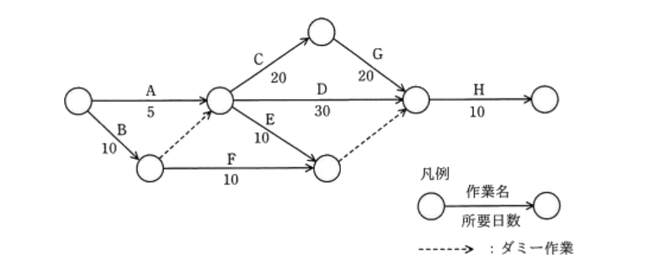

+++
date = '2025-09-01T13:59:43+09:00'
draft = false
title = '勉強メモ：応用情報技術者試験'
tags = ["勉強メモ"]
+++

## スクラップメモの目的

応用情報技術者試験勉強中の知らないキーワードや概念をメモにして整理


## 参考資料
- [令和07年【春期】【⁠秋期】応用情報技術者 合格教本](https://gihyo.jp/book/2024/978-4-297-14620-7)
- [応用情報技術者過去問道場](https://www.ap-siken.com/apkakomon.php)

## ユーザービリティ評価手法

### アンケート
質問票を配布してユーザーから回答を集める手法。

### 思考発話法
被験者に操作をしながら考えていることを声に出してもらい、思考プロセスを分析する手法。

### 回顧法
操作後に操作内容やその時の判断、感想などを思い出してもらい、ヒアリングする手法。

### ログデータ分析法
ユーザーの操作ログを収集・解析し、利用状況や問題点を定量的に評価する手法。

### 認知的ウォークスルー法
専門家がユーザーの視点に立ってタスクを実行し、ユーザーが目標を達成できるか、操作で迷わないかなどを評価する手法。

### ヒューリスティック評価
専門家が経験則（ヒューリスティックス）に基づいて、UIなどがガイドラインに沿っているかを評価する手法。

## 二モニックコード
商品の略称や記号など、記憶しやすいように意味を持たせたコード。
例：「B5」→ B5用紙
別名：表意コード

## パンくずリスト
Webサイト内でユーザーが現在閲覧しているページの位置を、トップページからの階層構造で示したもの。
名前の由来は童話「ヘンゼルとグレーテル」で、主人公が森で迷わないようにパンくずを落として道しるべにした逸話から。

## コンピュータグラフィックスの基本技術

### レンダリング
3D空間の物体のデータ（形状、質感、光源など）を基に、2次元の画像を生成する処理。

#### レイトレーシング法
光源から出た光が物体に反射し、視点に届くまでの経路を逆に追跡することで、リアルな画像を生成するレンダリング手法。光の反射や屈折を精密に計算できる。

#### Zバッファ法
視点からの奥行き情報（Z値）をピクセルごとに保持し、不要な部分（隠れた部分）を描画しないことで、効率的に隠面消去を行うレンダリング手法。

#### ラジオシティ法
物体表面での光の相互反射（間接光）を計算することで、柔らかな陰影や、部屋の壁が照らし合う様子などをリアルに表現するレンダリング手法。

### アンチエイリアシング
斜線や曲線の境界に生じる階段状のギザギザ（**ジャギー**）を、中間色を補うことで滑らかに見せる手法。

### ディザリング
**色数**が限られた環境で、異なる色のピクセルを隣接して配置することで、擬似的に中間色や多くの色を表現する手法。

### メタボール
複数の球体を定義し、それらが融合し合うような滑らかで有機的な曲面を生成するモデリング手法。液体や粘体などの表現に用いられる。

## パルス符号変調（PCM）の符号化手順

1. **標本化（サンプリング）**
   アナログ信号を一定の時間間隔で区切り、その瞬間の値を取り出す。**1秒間**にサンプリングする回数をサンプリング周波数（Hz）と呼ぶ。

2. **量子化**
   標本化で得られたアナログ値を、最も近い離散的な値（整数値）に近似する。このとき、1つの値を表現するために使うビット数を量子化ビット数と呼ぶ。

3. **符号化**
   量子化で得られた整数値を、0と1の2進符号に変換する。

## 全般統制と業務処理統制の違い
- 全般統制：組織や集団全体を対象
- 業務処理統制：個々の業務が対象

## システム監査基準
監査人が従うべき行動規範

## 計算問題

### 帯域幅（R6秋午前問26）

**問題**
- 解像度: 800 × 600 ピクセル
- 色深度: 24ビットフルカラー
- フレームレート: 30フレーム/秒

上記の動画像の配信に最低限必要な帯域幅はいくつか。

**計算**
1.  **1フレームあたりのデータ量**
    `800 × 600 ピクセル × 24 ビット/ピクセル = 11,520,000 ビット = 11.52 Mビット`

2.  **1秒あたりのデータ量（帯域幅）**
    `11.52 Mビット/フレーム × 30 フレーム/秒 = 345.6 Mビット/秒 (Mbps)`

**答え**
345.6 Mbps

### 色数（H17春午前問22）

**問題**
あるディスプレイのビデオメモリは、解像度「800 × 600画素」で最大「2^16色」の表示が可能である。このビデオメモリを流用して解像度を「1600 × 1200画素」に変更した場合、表示できる最大の色数はいくつか。

**計算**
1.  **必要なビデオメモリ容量の計算**
    - 1画素あたりのデータ量: 2^16色を表現するには16ビット（= 2バイト）必要。
    - ビデオメモリ容量: `800 × 600 画素 × 2 バイト/画素 = 960,000 バイト`

2.  **変更後の解像度で1画素あたりに割り当てられるデータ量の計算**
    - 変更後の総画素数: `1600 × 1200 画素 = 1,920,000 画素`
    - 1画素あたりのデータ量: `960,000 バイト / 1,920,000 画素 = 0.5 バイト = 4 ビット`

3.  **最大色数の計算**
    4ビットで表現できる色数は `2^4` 色。

**答え**
2^4色

### 音声サンプリング（H18春午前問55）

**問題**
- サンプリング周波数: 11,000回/秒
- 量子化ビット数: 8ビット
- 記録媒体: 32 × 10^6 バイトの容量を持つUSBメモリ

この条件で、最大何分間の音声を保存できるか。

**計算**
1.  **1秒あたりのデータ量**
    `11,000 回/秒 × 8 ビット/回 = 88,000 ビット/秒`

2.  **1分あたりのデータ量（バイト単位）**
    - `88,000 ビット/秒 × 60 秒/分 = 5,280,000 ビット/分`
    - `5,280,000 ビット/分 / 8 ビット/バイト = 660,000 バイト/分`

3.  **記録可能な時間（分）**
    `32,000,000 バイト / 660,000 バイト/分 ≈ 48.48 分`

**答え**
最大 **48分**

### アローダイアグラムにおける総余裕日数（H31春午前問53）

**問題**

> 応用情報技術者試験 平成31年春期 午前問53 より引用

上図のアローダイアグラムにおいて、総余裕日数は何日か。

**計算**
総余裕日数は「その作業の開始をどれだけ遅らせても、プロジェクト全体のスケジュールに影響を与えないか」を示す日数。以下の手順で計算する。

1.  **最遅結合点時刻の計算（終点から始点へ）**
    B・C・G・H のルート（60日）
    プロジェクトの最短完了日数（クリティカルパス）は **60日**。

1.  **最早結合点時刻の計算（始点から終点へ）**
    H・D・B（30日） 

2.  **作業Fの総余裕日数の計算**
    `総余裕日数 = 最遅結合点時刻 - 最早結合点時刻`
    `総余裕日数 = 60 - 30 = 30`

**答え**
**30日**